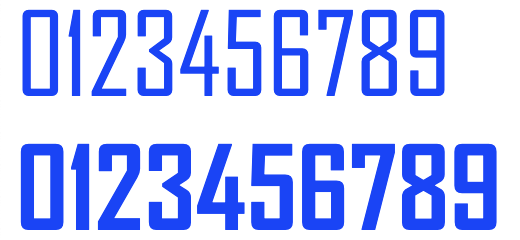
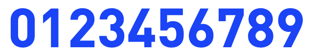

## 以往可视化大屏积累的特殊字体

- [汉仪菱心体简](fonts/%E6%B1%89%E4%BB%AA%E8%8F%B1%E5%BF%83%E4%BD%93%E7%AE%80.ttf)（该字体用于显示中文效果比较好）

- [锐字逼格青春体简](fonts/%E9%94%90%E5%AD%97%E9%80%BC%E6%A0%BC%E9%9D%92%E6%98%A5%E4%BD%93%E7%AE%802.0.TTF)

- [非等宽LED](fonts/UnidreamLED.ttf)

- [等宽LED](fonts/fzcy_gbk-webfont.woff)

- [另外一种形式的LED](fonts/led16sgmnt2-Regular-2.ttf)
- [另外一种形式的LED-斜体](fonts/led16sgmnt2-Italic-1.ttf)

- [AGENCYR](fonts/AGENCYR.TTF)
- [AGENCYB](fonts/AGENCYB.TTF)

- [DIN](fonts/DIN-Bold.otf)

- [优设标题黑](fonts/%E4%BC%98%E8%AE%BE%E6%A0%87%E9%A2%98%E9%BB%91.ttf)
